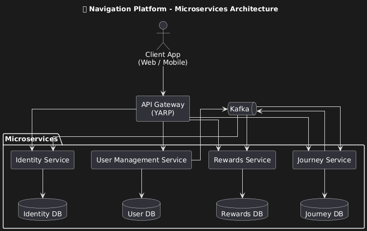
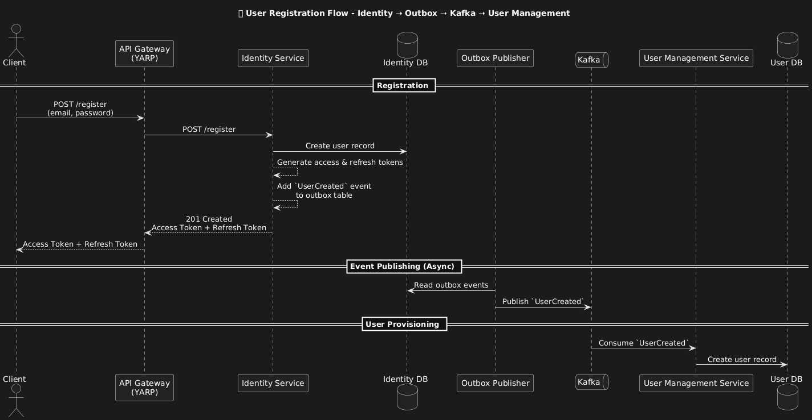
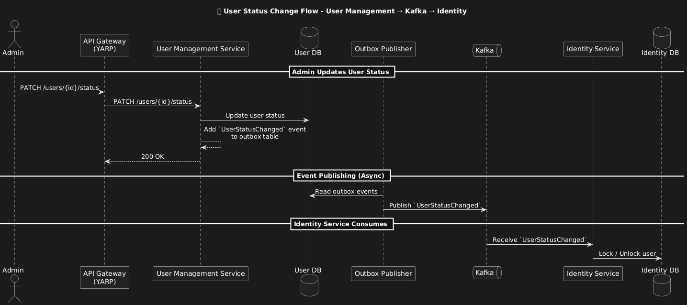
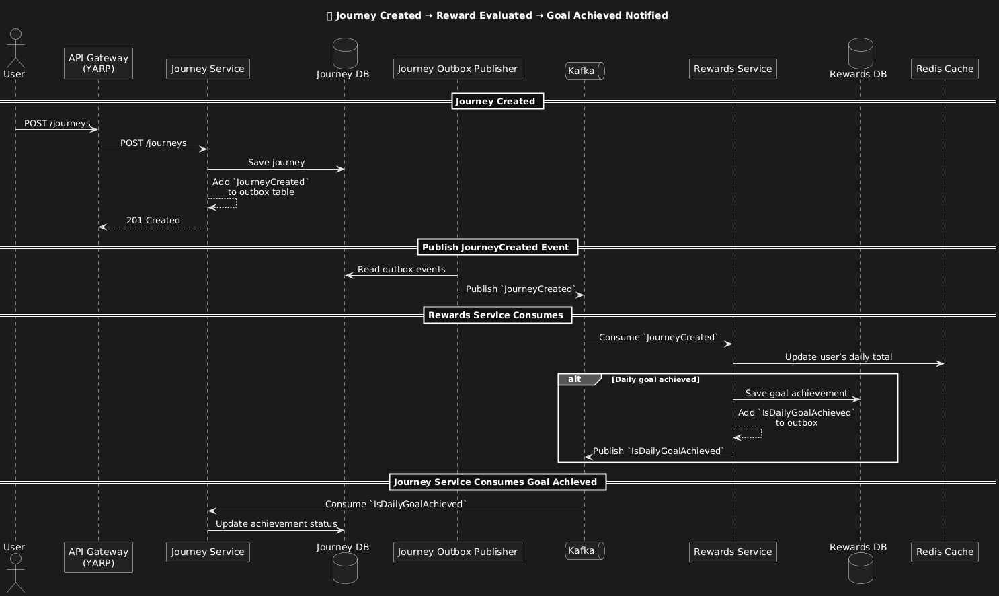
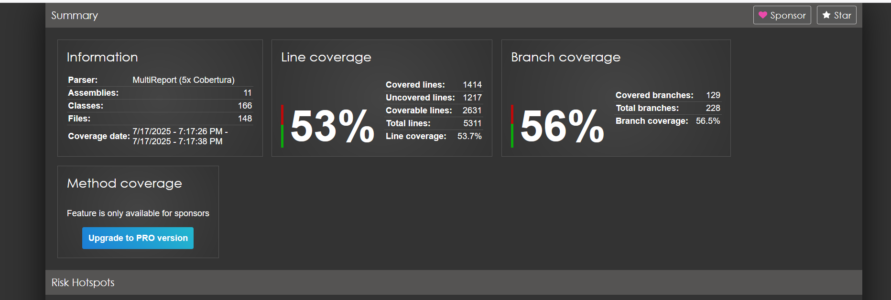

# navigation-platform-microservices

Start the project
docker-compose up --build

NET Core microservices platform with YARP gatewa

## 📌 Architecture

Architecture Design Decisions & Trade-Offs (Navigation Platform)

1. Service-per-Domain with Independent Databases

Decision: Each core domain (Identity, User Management, Journey, Rewards) is isolated in its own microservice and owns its database.

Why:
To enforce strong domain boundaries, allow independent deployment, and prevent tight coupling across teams and features.

Trade-offs:

    Forces eventual consistency across services
    Requires additional patterns like outbox + Kafka to synchronize state
    More infrastructure complexity (more DBs, migrations, monitoring)

2. API Gateway (YARP) for Request Routing

Decision: All client communication goes through a central YARP-powered API Gateway.
Why:
To centralize authentication, routing, logging, and make backend services unreachable from the public network.
Trade-offs:
Introduces a potential bottleneck or single point of failure
Requires custom configuration and versioning for evolving endpoints

3.  Identity-Centric Auth with Token Issuance

Decision: Identity Service issues access and refresh tokens on registration and login.

Why:
To separate authentication from user data and keep Identity Service lightweight and focused.

Trade-offs:

    Requires token-aware services or validation at the gateway

    Event-driven user provisioning (e.g., UserRegistered → User Management) introduces temporal gaps where identity exists but profile does not

Data Flow Examples

User registered data flow

User status changed

Daily goal achieved

CODE Coverage :

